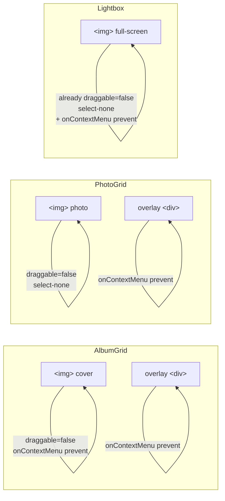

# 0001 — Right-Click / Drag-to-Download Protection

**Date:** 2026-05-03
**Status:** Accepted
**Author:** Architect Agent
**Related ADRs:** [docs/decisions/0007-right-click-download-protection.md](../decisions/0007-right-click-download-protection.md)

## Problem Statement

All photo `` elements on the site are currently unprotected: any visitor can
right-click and select "Save Image As", or drag an image directly to the desktop/finder
to download the full-resolution file. This makes it trivially easy to bypass the
intentional friction of a portfolio site where the photographer controls redistribution.
The affected surfaces are: album cover images in `AlbumGrid`, grid photos in `PhotoGrid`,
and the full-screen image in `Lightbox`.

## Proposed Solution

Apply a consistent set of browser-level deterrents to every `` element that renders
a portfolio photo:

1. **`onContextMenu` suppression** — `e.preventDefault()` blocks the native browser
   context menu (right-click / long-press) on the image element.
2. **`draggable={false}`** — prevents the native drag-and-drop download gesture.
3. **`user-select: none` / `-webkit-user-drag: none`** — CSS reinforcement via a shared
   Tailwind utility class `select-none` and an inline style or CSS class for
   `-webkit-user-drag: none`.
4. **Pointer-events overlay** — a transparent `
` absolutely positioned over each
   image in grid/album contexts absorbs pointer events and suppresses the context menu,
   preventing the underlying `` from ever receiving the right-click directly.
   (The overlay already exists in `PhotoGrid` and `AlbumGrid` as the hover-tint layer;
   it will be augmented with `onContextMenu` suppression.)

These changes are applied directly to the three existing components; no new component or
shared hook is introduced (the surface area is small and the pattern is simple). The
`Lightbox` image already has `draggable={false}` and `select-none`; only
`onContextMenu` suppression is missing there.

### Files changed

| File | Change |
|---|---|
| `components/AlbumGrid.tsx` | Add `draggable={false}` + `onContextMenu` to ``; add `onContextMenu` to overlay `
` |
| `components/PhotoGrid.tsx` | Add `onContextMenu` to overlay `
`; add `draggable={false}` to `` |
| `components/Lightbox.tsx` | Add `onContextMenu` to `` (draggable/select-none already present) |

## Alternatives Considered

### Alternative A — Shared `useProtectedImage` hook
Extract the `onContextMenu` + `draggable` logic into a reusable hook or HOC. Ruled out
because there are only three call sites and the logic is two lines; abstraction adds
indirection without meaningful reuse benefit.

### Alternative B — CSS `pointer-events: none` on `` directly
Setting `pointer-events: none` on the `` would prevent right-click but also break
the click-to-open-lightbox behaviour in `PhotoGrid` (the click is on the `<button>`, but
the image fills it; native context menu targets the `` not the button). The overlay
approach is more surgical.

### Alternative C — Serve watermarked or low-resolution thumbnails
A true technical deterrent: serve only low-res images publicly and require auth for
full-res. Ruled out — this is a significant infrastructure change (auth, separate asset
pipeline), outside the scope of this request, and inconsistent with the fully-public
static nature of the site.

## Impact Assessment

| Area | Impact | Notes |
|---|---|---|
| Database | None | Static data unchanged |
| API contract | None | No API |
| Frontend | Minor component change | Three components, additive attributes only |
| Tests | None | No test suite; verify with `npm run build` + `npm run lint` |
| External API | None | |
| Infrastructure | None | |
| Observability | None | |
| Security / Compliance | Reduced casual download surface | Not a hard technical barrier; motivated users can still view source or use DevTools |

## Open Questions

None.

## Acceptance Criteria

- Right-clicking any photo in `AlbumGrid` does not show the browser context menu.
- Right-clicking any photo in `PhotoGrid` (grid view) does not show the browser context menu.
- Right-clicking the full-screen photo in `Lightbox` does not show the browser context menu.
- Dragging any photo image does not initiate a native drag-and-drop download.
- The `select-none` class is present on all photo `` elements.
- `npm run build` and `npm run lint` both pass with no errors.
- Clicking a photo in `PhotoGrid` still opens the `Lightbox` (no regression).
- Album cover clicks in `AlbumGrid` still navigate to the album page (no regression).
